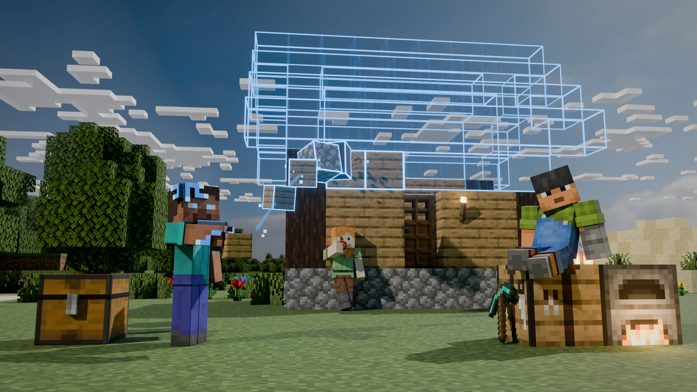
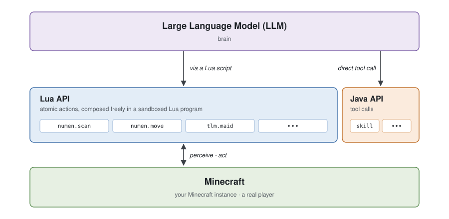

# Numen · 言出法随

### 运行在 Minecraft 内部的具身智能体

[English](README_EN.md) · [**简体中文**](README.md)

[**安装**](#安装) · [**快速开始**](#快速开始) · [**架构**](#架构) · [**插件**](#插件) · [**常见问题**](#常见问题) · [**文档**](https://numen.dwinovo.cn)

## 简介

言出法随（Numen）是一个运行在 Minecraft 内部的具身智能体。它以模组的形式直接存在于游戏之中，拥有一具真实的玩家身体，能够在 Minecraft 世界中持续探索，自主决策并采取行动来完成你交给它的任务。

## 安装

言出法随已发布在 CurseForge，在你常用的 Minecraft 启动器中搜索 "Numen" 即可下载。Fabric 端需要同时安装 [Fabric API](https://modrinth.com/mod/fabric-api)。

| Minecraft 版本 | 加载器 | Java |
|---|---|---|
| 1.20.1、1.20.2、1.20.4 | Fabric、Forge | 17 |
| 1.20.6、1.21、1.21.1、1.21.4、1.21.5、1.21.8、1.21.10、1.21.11 | Fabric、NeoForge | 21 |
| 26.1.2、26.2 | Fabric、NeoForge | 25 |

## 快速开始

1. **配置模型。** 进入游戏后按下打开面板的快捷键（默认为 `G`，1.21.8 及以上版本为 `N`，可在游戏的按键设置中修改），在设置页中选择模型服务并填入你自己的 API key。
2. **召唤智能体。** 在面板中召唤一个智能体，为它起一个名字。
3. **开始交流。** 像与任何智能体交流一样，用自然语言告诉它你想做的事。

言出法随原生支持 OpenAI 与 Anthropic 两种接口协议，并内置了以下模型服务的预设。对于未列出的服务，只要它兼容其中一种协议，填入地址即可使用。

| 类别 | 内置预设 |
|---|---|
| 海外 | OpenAI、Anthropic、Gemini、Grok、OpenRouter |
| 国内 | DeepSeek、Kimi、智谱 GLM、豆包、Qwen、MiniMax、硅基流动 |
| 本地部署 | Ollama、LM Studio、vLLM |

### 外接大脑

言出法随可以整体作为一个 MCP 服务器，由外部的智能体直接驱动，例如 Claude Code、Codex、Cursor 等任何支持 MCP 协议的客户端。此时推理和 token 消耗都计在外部智能体上，你可以用这些客户端的订阅套餐来驱动它，通常比按量调用 API 更划算。开启后内置的大脑会停止工作，同一具身体不会同时被两个大脑控制。配置方法见[外接大脑文档](docs/mcp-server.md)。

### 常用操作

| 按键 | 作用 |
|---|---|
| `G`（1.21.8 及以上为 `N`） | 打开面板 |
| `Y` | 不打开面板，快速输入一句话 |
| 按住 `R` 并滚动鼠标滚轮 | 有多个智能体时，选择当前对话的对象 |
| 按住 `V` | 语音输入，松开后发送，不影响 WASD 移动 |

面板的设置页还提供以下功能。

- **人设**：内置了几种简单的人设，你也可以写入任何自己喜欢的人设。
- **皮肤**：为召唤出的智能体设置皮肤，上传的皮肤经由 MineSkin 签名后生效。
- **语音**：配置语音输入与语音输出，让智能体能听会说。
- **群聊**：把不同智能体的头像拖到一起即可建立群聊。在群聊中可以 @ 某个成员让它回复，也可以不 @ 任何人向全体广播。

## 架构

  

言出法随的系统架构自下而上分为三层。最底层是 Minecraft 游戏本身，智能体在其中操纵一个真实的玩家。

中间层是言出法随向大语言模型开放的接口，按调用方式分为 Lua API 与 Java API 两部分。Lua API 占据这一层的主体，由一组原子动作构成，每个动作只针对一个对象完成一种意图，涵盖感知、移动、挖掘、建造与交互等能力。除言出法随自身提供的接口外，这一层同样容纳其他模组经由插件接入的接口，例如车万女仆的女仆管理接口，因而智能体能够操作的内容不局限于原版游戏。Lua API 与 Minecraft 之间存在双向联系，智能体通过它感知世界的状态，也通过它对世界施加行动。Java API 只占这一层的一小部分，以工具调用的形式直接暴露给模型，用于加载技能等与模型自身认知相关、并不作用于游戏世界的功能。

最上层是大语言模型，负责推理与规划。模型以两种方式调用下层接口。对于 Lua API，模型编写一段在沙箱中运行的 Lua 程序，在程序中自由组合多个原子动作，一次调用即可连续完成数十个步骤。对于 Java API，模型则通过一次工具调用直接使用。该架构对具体的模型服务不作限定，模型仅承担大脑的角色，无需对其进行微调。

## 插件

基于上述架构，任何开发者都可以通过插件向言出法随注册新的 Lua API，供模型调用，从而让智能体学会使用其他模组。本仓库的 `plugins` 目录已经为以下模组提供了插件，可以作为编写插件的参考模板。

| 模组 | 智能体能做什么 |
|---|---|
| 是，史蒂夫模型（YSM） | 切换自己的模型与贴图，播放动作 |
| 车万女仆 | 驯服女仆、管理女仆的工作与设置，以及穿戴女仆模型 |
| 森罗厨房 | 查询菜谱，按步骤在锅中做菜 |
| FTB 任务 | 查看可做的任务，提交任务所需的物品 |
| Curios | 在饰品栏中穿戴饰品 |

完整的开发者文档见 [numen.dwinovo.cn](https://numen.dwinovo.cn)。

## 常见问题

**我的 API key 安全吗？**
安全。智能体的推理发生在你自己的客户端上，API key 只保存在本地，直接发往你选择的模型服务，不经过任何第三方服务器，也不会上传到游戏服务器。

**联机服能用吗？**
能。言出法随是双端模组，服务端与客户端都安装后即可在联机服中使用。每位玩家使用自己的 API key，驱动属于自己的智能体。

**要花钱吗？**
言出法随本身开源免费，调用大模型使用的是你自己的 API key，费用由你选择的模型服务决定。

## 致谢

感谢每一位关注、下载和使用言出法随的人。
